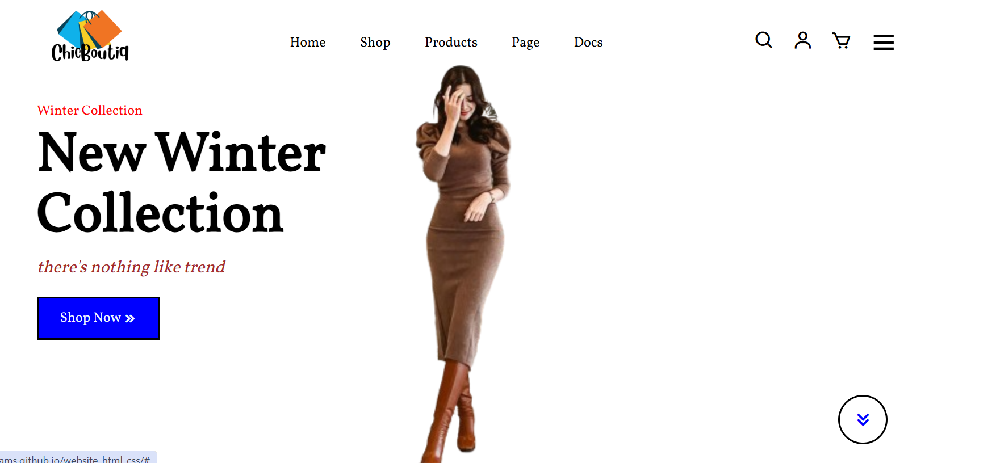

# Premium Senior Portfolio – Salma Lamsaaf

A senior-level, highly animated developer portfolio built with the latest modern web tech stack. This project was migrated from a standard Vite setup to a professional **Next.js 15 App Router** architecture with a focus on "perfect" design, smooth micro-interactions, and 3D effects.

 *(Note: Add a high-res screenshot here)*

## 🚀 Key Features

- **Next.js 15 App Router**: Leveraging the power of Server Components and modern routing.
- **Premium 3D Visuals**:
    - **Particle Network**: 2500+ golden particles orbiting in 3D space using **React Three Fiber**.
    - **3D Tilt Cards**: Interactive project cards that respond to mouse movement with perspective and specular highlights.
- **Advanced Animations**:
    - **Staggered Reveals**: Smooth entrance animations for all sections.
    - **Custom Spring Cursor**: A lag-free, custom-designed cursor that interacts with the UI.
    - **Tech Marquee**: Infinite-scroll technology strips for a dynamic brand feel.
    - **Interactive Count-Up Stats**: Animated metrics that trigger on visibility.
- **Clean Architecture**: Modular, typed, and reusable component structure.
- **Tailwind CSS v4**: Utility-first styling with custom glassmorphism and theme variables.
- **Responsive Design**: Flawless experience across mobile, tablet, and desktop.

## 🛠️ Tech Stack

- **Framework**: [Next.js 15](https://nextjs.org/)
- **Styling**: [Tailwind CSS](https://tailwindcss.com/)
- **Animations**: [Framer Motion](https://www.framer.com/motion/)
- **3D Engine**: [Three.js](https://threejs.org/) via [React Three Fiber](https://r3f.docs.pmnd.rs/) & [Drei](https://github.com/pmndrs/drei)
- **Language**: [TypeScript](https://www.typescriptlang.org/)
- **Icons**: [Lucide React](https://lucide.dev/)

## 🏁 Getting Started

### 1. Clone the repository
```bash
git clone https://github.com/salma-lams/portfolio.git
cd portfolio
```

### 2. Install dependencies
```bash
npm install
```

### 3. Run the development server
```bash
npm run dev
```

Open [http://localhost:3000](http://localhost:3000) with your browser to see the result.

## 📁 Project Structure

```text
src/
├── app/             # App Router pages and global styles
├── components/      # Reusable UI components (Hero, About, Projects, etc.)
├── public/          # Static assets (images, icons, etc.)
└── ...              # Configuration files (next.config, tailwind.config, etc.)
```

## 📄 License

This project is open-source. Feel free to use and modify it for your own portfolio!

---
Built with 💛 by [Salma](https://github.com/salma-lams)
*Last updated: March 14, 2026*
