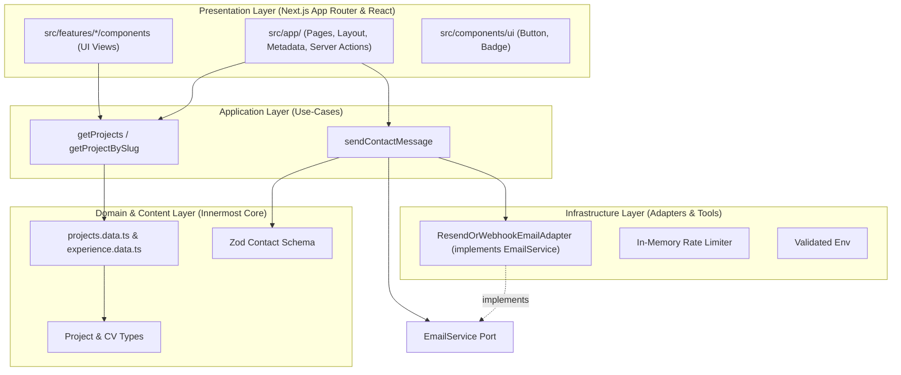
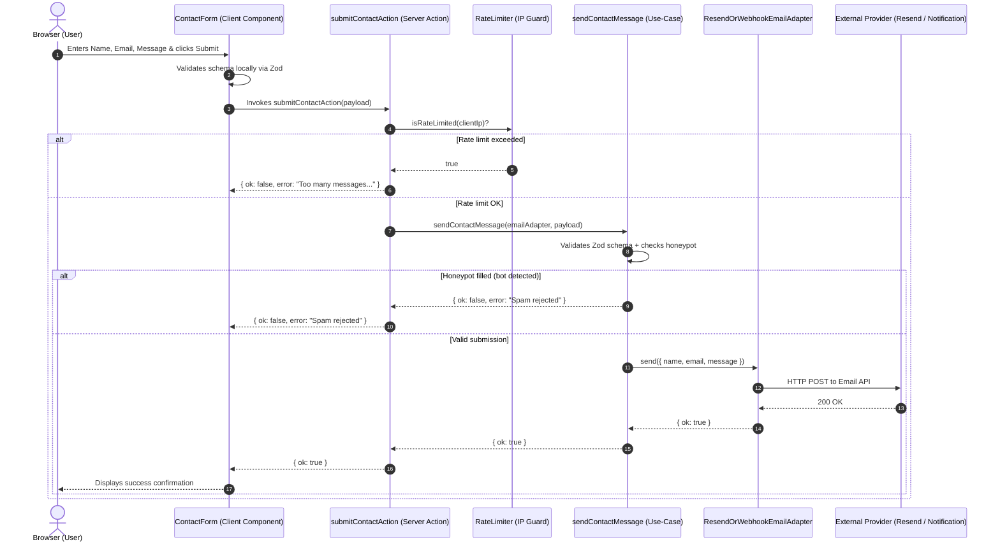

# Architecture Documentation

## Overview
This portfolio is engineered with **Clean Architecture principles** right-sized for a modern web application deployed on Vercel with Next.js 16 (App Router), TypeScript, and Tailwind CSS.

Dependencies strictly point **inward** toward pure domain models and use-cases.

---

## 1. Clean Architecture Layers

### Dependency Rules:
1. **Domain / Content (Innermost)**: Pure TypeScript types and static data. Zero dependencies on React, Next.js, or external HTTP clients.
2. **Application (Use-Cases)**: Pure functions orchestrating domain entities and ports (`EmailService`).
3. **Infrastructure (Adapters)**: Implementations of ports (e.g. `ResendOrWebhookEmailAdapter`). Swappable without modifying application logic.
4. **Presentation (Outermost)**: Next.js Server Components, client components, and layouts. They invoke use-cases and receive typed domain objects.

---

## 2. Contact Submission Flow

---

## 3. Rendering Strategy: Static Site Generation (SSG)

- **Home (`/`)**: Statically rendered at build time with React Server Components.
- **Projects (`/projects/[slug]`)**: Statically generated at build time using `generateStaticParams`.
- **Contact Handling**: Server Action running on demand on the serverless edge with IP rate limiting and honeypot spam protection.
